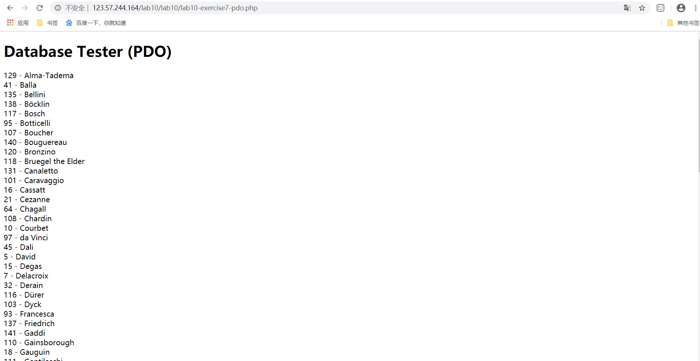
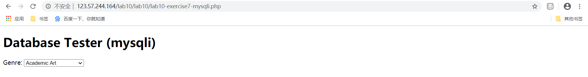
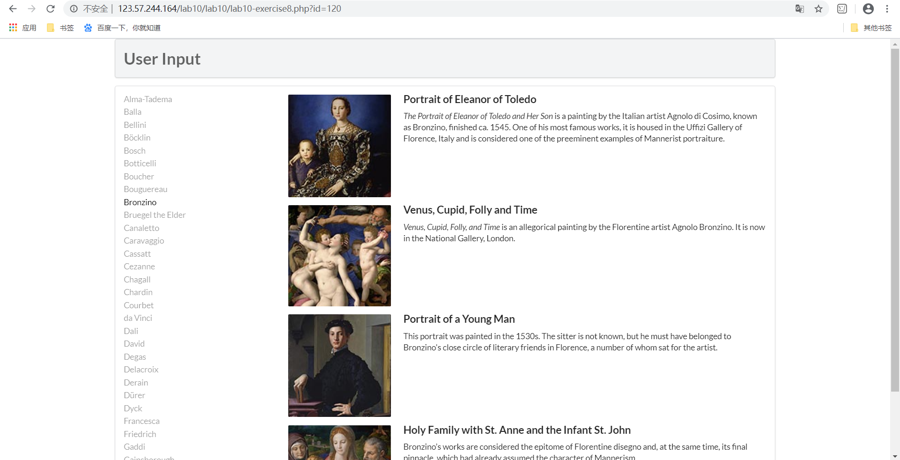
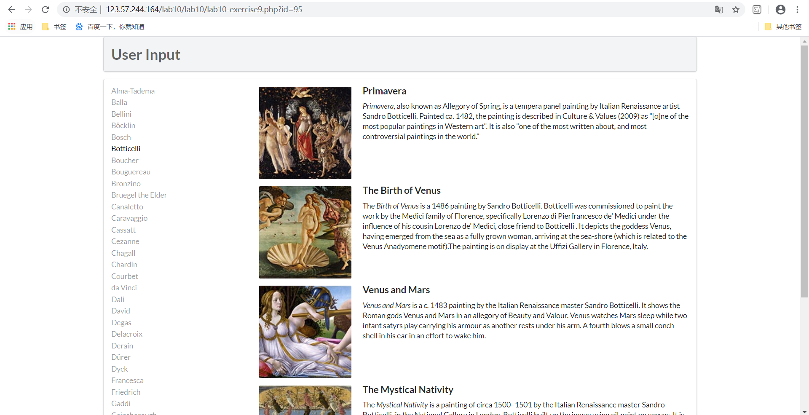

# Web应用基础 Lab10

贾子安 18307130017

## Exercise 7

---------------------------------

### PDO:

- 初始化PDO对象，连接mysql，查询所有的Artist并且以LastName排序，遍历结果并输出。

### mysqli:

- 使用mysqli连接mysql，查询所有的Artist并且以LastName排序，遍历结果并输出，最后释放内存并关闭连接。
  
## Exercise 8

---------------------------------

- function outputArtists():查询所有的Artist并且按LastName排序，取前30个，添加对应的html语句。 
- function outputPaintings():如果选中某个Artist，则查询这个Artist对应的所有Painting并全部展示出来。
- function outputSinglePainting():展示单个Painting。

## Exercise 9

---------------------------------

- 使用php执行sql语句的方法：
- 使用PDO：
- (1).exec()方法，执行sql语句并返回受影响的行数。
- (2).query()方法，执行sql语句并返回查询结果。
- (3).prepare()方法，做sql语句的查询预处理。
- (4).execute()方法，执行预处理的查询。
- 使用mysqli：query()方法。
  
- 使用预处理的好处：
- (1).预处理sql能一定程度上防止sql注入
- (2).sql预编译效率更高
- (3).二进制包协议让sql预处理更加高效
