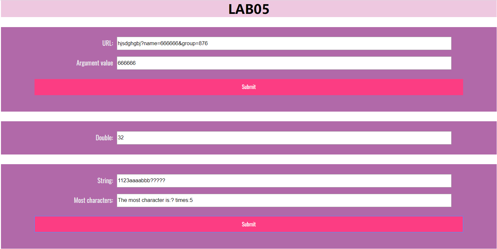
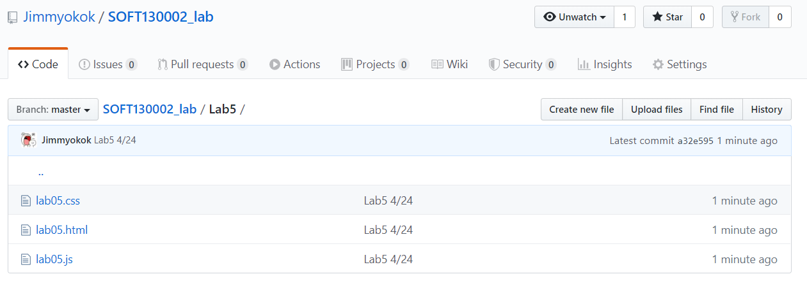

# Lab5设计文档

贾子安
18307130017

---------------------------
## 1. 完成截图

<div align=center></div>

<div align=center></div>

---------------------------

## 2. 实现细节

### 2.1. 提取name参数

<div align=center></div>

  > 仅修改了函数showWindowHref()内部

  - 提取url输入框内的字符串。

  ```js
  var url_string=String(url.value);
  ```

  - 提取从第一次出现`"name="`到`"&"`出现为止的子串，作为结果输出。

  ```js
  url_result.value = url_string.substring(url_string.indexOf("name=")+5,url_string.indexOf('&',url_string.indexOf("name=")));
  ```

---------------------------

### 2.2. 每隔五秒输入框内数字翻倍

<div align=center></div>

  > 修改了函数timeTest()内部及外部

  - 设置一个计时器，其周期为五秒，每次倒计时结束运行函数`timeTest()`。

  ```js
  var timer=setInterval(function(){
    timeTest();
  }, 5000);
  ```

  - 提取输入框内的内容，如果没有内容则设为数字1
  - 如果有内容则使其翻倍
  - 如果翻倍前数字是`512`(即已经运行十次)，则让计时器停止计时。

  ```js
  function timeTest(){
    var num=mul.value;
    if(!num)mul.value="1";
    else mul.value=String(num*2);
    if(num==512)clearInterval(timer);
  }
  ```

---------------------------

### 2.3. 判断输入框里出现最多的字符，并统计出来

<div align=center></div>

  > 仅修改了函数arrSameStr()内部

  - 提取输入框内容。

  ```js
  var str=String(most.value);
  ```

  - 创建一个空数组。

  ```js
  var char=[];
  ```

  - 对于字符串的每一个字符，找出它在字符串中出现的次数`num`，并且给数组的第`num`项赋值该字符。
  - 当遍历完字符串中每一个字符后，数组`char[]`的最后一项即为出现次数最多的字符。

  ```js
  for(var i=0;i<str.length;i++){
        var num=0;
        var loc=-1;
        do{
            loc=str.indexOf(str[i],loc+1);
            if(loc!=-1)num++;
        }while(loc!=-1);
        char[num]=str[i];
    }
  ```
  - 输出结果信息。

  ```js
  if(!char.length)result.value="Empty string!";
  else result.value="The most character is:" + char[char.length-1] +" times:" + (char.length-1);
  ```

## 3. 参考资料

<a href="https://github.com/fudansswebfundamental">fudansswebfundamental</a>

<a href="https://www.w3school.com.cn/">W3school</a>


	

