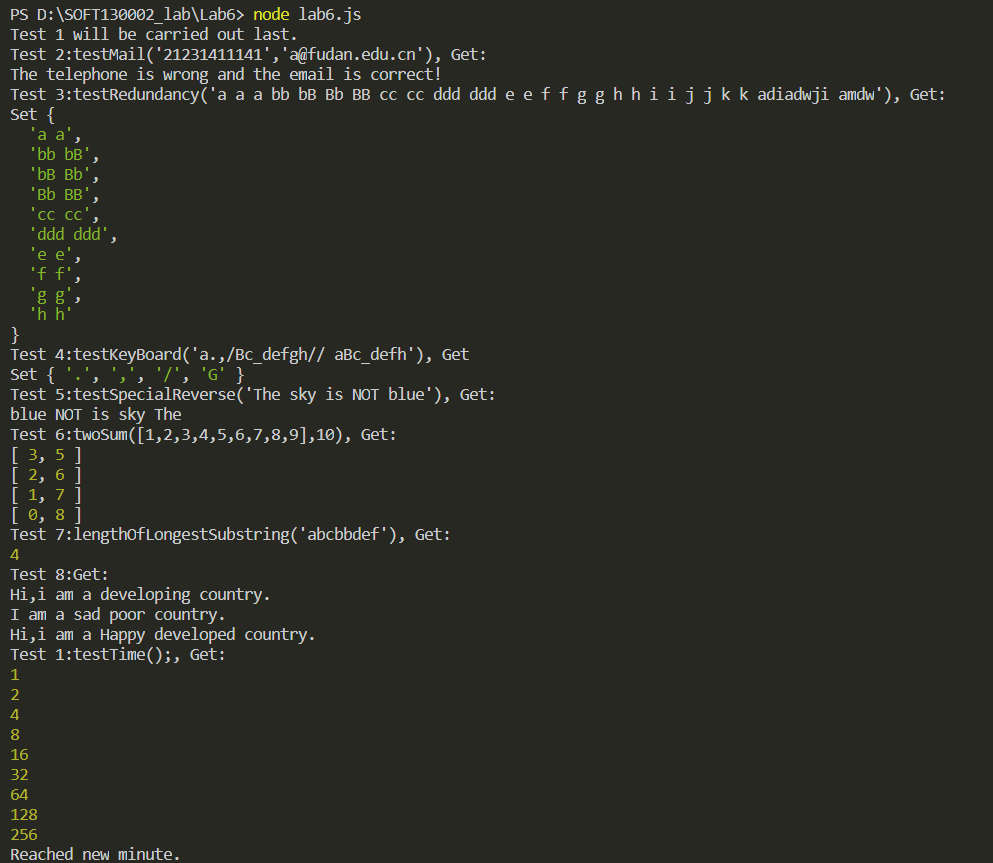
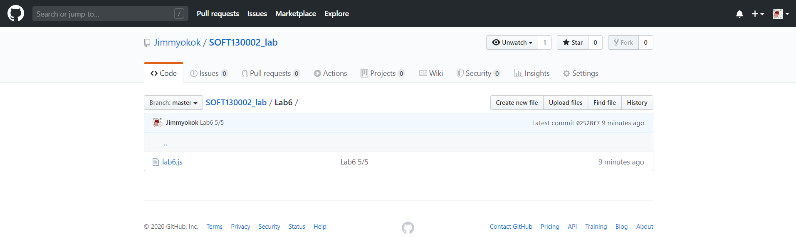

# lab6 设计文档

贾子安 18307130017

## 完成截图

<div align=center></div>

<div align=center></div>

## 1. 正则表达式

----------

### 1.1. function2:判断手机号和邮箱的格式是否正确。

- 手机号格式:

  ```js
  /^[1]([0-9]{10})/
  ```

  解释：开头为`1`，后面为十位数字。

- 邮箱格式:

  ```js
  /^([a-zA-Z0-9_-])+@(([a-z]+\.)+)([a-z]{2,4})/
  ```

  解释：开头为多个由`数字、字母、下划线、连接符`组成的用户名，紧接着为`@`，后面为多个单词加.的组合，如`fudan.`、`edu.`，最后是2-4位字母组成的单词，如`com`、`cn`等。

### 1.2. function3:找到字符串里所有相邻重复单词对放入set中，超过十个则输出以首字母顺序前十个。

- 判断相邻两个重复单词：
  
  ```js
  /(\w+)\s+(\1)/i
  ```
  解释：`(\w+)`匹配一个单词，`\s+`匹配一个或多个空格，`(\1)`匹配和`(\w+)`中一样的内容。

- 两个相邻重复单词对互相重叠时，即使加了global标签也只能匹配前一个，
  如"Is is iS"只能匹配到"Is is"，
- 解决办法：不加global标签，循环多次匹配，每次匹配到一对相邻重复单词，把它替换成这一对单词中的后一个，直到无法匹配到任何一对。
- 如："IS Is iS is" -> "Is iS is" -> "iS is" -> "is"。
  ```js
  var arr=new Array();
  while(true){
      var arr0=str.match(pat);
      if(arr0==null)break;
      arr.push(arr0[0]);
      str=str.replace(pat,"$2");
  }
  ```

### 1.3. function5:给定一个输入英文语句字符串，反转该语句。
- 判断一个单词：
  ```js
  /(\S+)/ig
  ```
  解释：多个连续的不是空格的字符组成的即为句中的单词。

## 2. 继承

-------

### 2.1. 原型链继承
- 将子类的原型设为父类的实例。
- 当寻找子类的某个属性时，如果子类的实例没有这个属性，就会寻找子类的原型，也就是一个父类的实例，如果该实例也没有这个属性，就会循着原型链继续向上寻找。
- 从而实现了子类对父类的继承。
- 原型链继承无法在不影响其他子类实例的情况下：
  - 向父类构造函数传参
  - 修改父类实例的引用属性
### 2.2. 借用构造函数继承
- 通过直接让子类实例调用父类构造函数，在子类实例上创建父类所有的属性和方法，从而实现继承。
- 缺点：
  - 无法复用和批量修改
  - 冗余严重，内存占用大
### 2.3. Object.create
- 此方法接受一个对象作为参数，然后以它为原型，创建一个实例对象。完全继承原型对象的属性和方法。
- 实质是新建一个空的构造函数，然后让该构造函数的prototype属性指向传入的参数，最后返回一个该构造函数的实例。
  
## 3. Array,Set和Map

----------

### 3.1. Array
- 具有索引，可以通过[]获得特定的元素
- 可以有重复元素
- 通过new Array()创建一个空的Array对象
- 通过Array(size)创建一个包含size个undefined的Array对象
- 通过Array(element0, element1, ..., elementn)创建一个指定内容的Array对象
- 通过push、pop、shift、unshift方法向数组尾部、头部插入或者删除一个元素
- 通过splice方法在数组内部进行操作
- 通过sort()方法排序
- 通过concat()方法拼接两个数组
### 3.2. Set
- 没有索引，其中key不能重复
- 是一组[key,value]的集合，而value在set中并不存储
- 判断元素唯一性时不进行自动类型转换
- 通过new Set()创建一个空的Set对象
- 通过size属性获得元素个数
- 可以通过forEach、for ... in ...遍历
- 通过add方法添加元素，delete方法删除元素，has方法判断是否存在某一元素
### 3.3. Map
- 是一组[key,value]的集合
- 没有索引，其中key不能重复，一个key对应一个value
- 通过new Map()创建一个空的Map对象
- key、value可以是任意类型
- 通过set方法插入一对[key,value]或者修改对应key的value值
- 通过get方法获取key对应的value值
- 通过delete方法删除一对[key,value]，has方法判断是否存在一对[key,value]
- 通过keys(),values(),entries()遍历Map的key、value和[key,value]对
- 可以通过forEach、for ... in ...遍历

# 4.参考资料

<a href="https://github.com/fudansswebfundamental">fudansswebfundamental</a>

<a href="https://www.w3school.com.cn/">W3school</a>
